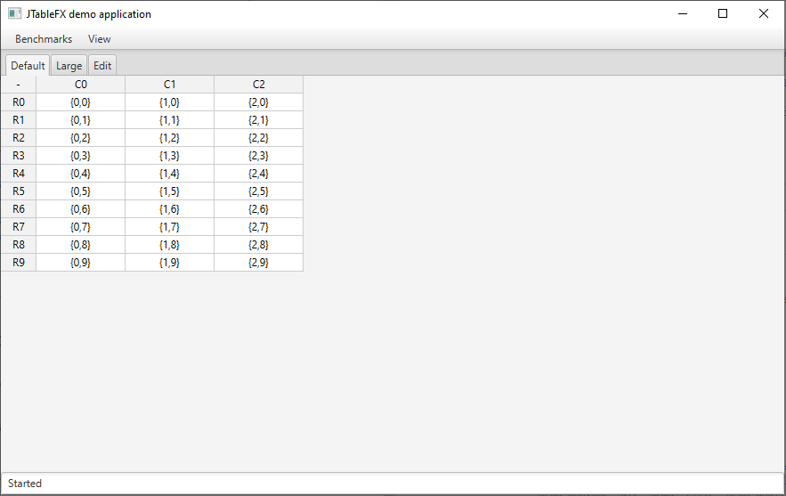

# JTableFX
An open source project for JavaFX that aims to provide a flexible and configurable user interface control to visualise and interact with a two-dimensional spreadsheet-like table grid of data cells.

## Features

* User interface control implemented using model-view-controller architecture pattern
* Highly configurable look and behaviour via method overloading
* Memory efficient for large tables
* Navigation and interaction by mouse and keyboard
* Data model defines table size plus getting and setting values
* Default table view implementation supports (not all implemented yet)
    * Display of different cell value data types
    * Editors for different cell value data types
    * Cell, column, and row selection
    * Column and row resizing and hiding
    * Column and row re-ordering
* Utility support methods 

## Demo application

The project includes a demonstration application that contains multiple examples to exhibit features and how to configure them. 



## Running the demo application from command line

The demo application can be executed by downloading the latest JAR from the project releases page and launching from the command-line.
As JavaFX is no longer bundled within the latest Java distributions, some extra command-line parameters are needed to reference the JavaFX library.

```
java --module-path %PATH_TO_FX% --add-modules=javafx.controls JTableFX.jar
```

## Running the demo application from Windows

To enable easy execution of JavaFX applications from Windows desktop or file explorer, you can use a command batch file such as [run_javafx.cmd](run_javafx.cmd)
* Create environment variable **PATH_TO_FX** pointing to the lib directory of the JavaFX SDK
* Create command file *run_javafx.cmd* in a desired location
* Associate JAR file type with *run_javafx.cmd* by right-click on a jar file, under *General* click *Change...* and locate & select the *run_javafx.cmd* command file

Now double-clicking any JAR file should open a command-line window and launch a runnable JAR Java application.

## Prerequisites

The project is written in Java using the JavaFX GUI library.
JavaFX is no longer bundled with the latest Java JREs and JDKs, so needs to be installed separately.

Below is some guidance for Eclipse on Windows users.

1. **OpenJDK 11 (or later)**
    * Download an appropriate [Java JDK](https://openjdk.java.net/install/) and unzip it to a desired location
    * Update **PATH** environment variable by opening *Control Panel*, then *System*, click *Advanced* and then *Environment Variables*, and add the location of the bin folder of the JDK installation to the PATH variable in *System Variables*
    * Set **JAVA_HOME** by under *System Variables*, click *New*, enter the variable name as JAVA_HOME, enter the variable value as the installation path of the JDK (without the bin sub-folder), click *OK*, click *Apply Changes*
    * Configure the JDK in your IDE
    
1. **JavaFX 11 (or later)**
    * Download an appropriate [JavaFX SDK](https://gluonhq.com/products/javafx/) and unzip it to a desired location
    * In Eclipse create a new *User Library* under **Eclipse -> Window -> Preferences -> Java -> Build Path -> User Libraries -> New**, name it **JavaFX** and include the jars under the lib folder from JavaFX SDK
    * In Eclipse, include this new user library in the project *Modulepath* under **Eclipse -> Project -> Properties -> Java Build Path -> Libraries -> Add Library...**

After importing the source code into Eclipse, the project should now compile and run with no problems.

## Built with

* [Java](https://en.wikipedia.org/wiki/Java_(programming_language)) - General-purpose computer programming language
* [JavaFX](https://en.wikipedia.org/wiki/JavaFX) - Java software library used to generate the application's interactive graphical user interface 
* [Eclipse](https://en.wikipedia.org/wiki/Eclipse_(software)) - Integrated development environment (IDE) used to develop the project
